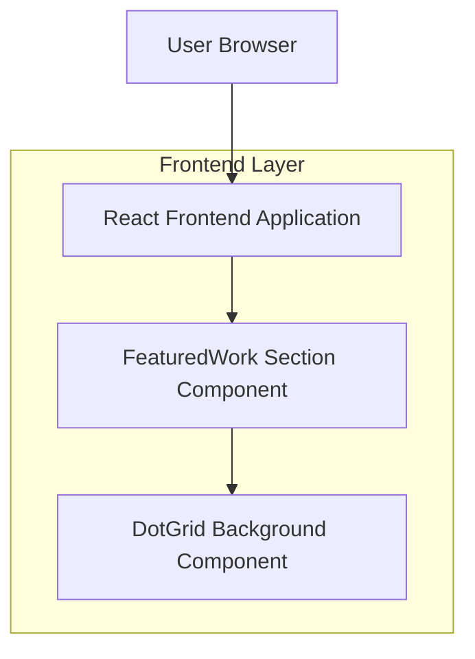

## 1.Architecture design

## 2.Technology Description
- Frontend: React@18 + TypeScript + (Vite or existing bundler) + CSS (Tailwind if already in the project)
- Backend: None

## 3.Route definitions
| Route | Purpose |
|-------|---------|
| / | Home page containing the Featured Work section with dot-grid background |

## 4.Implementation notes (dot-grid)
- Desktop vs mobile switch:
  - Treat “desktop animated” as environments with `pointer: fine` AND `hover: hover`.
  - Force static mode when `prefers-reduced-motion: reduce` is true.
- Rendering options (pick one, based on current code style):
  - **Canvas**: draw grid points, animate with `requestAnimationFrame`, compute influence by cursor distance.
  - **SVG/DOM**: render dots as circles/divs; animate via CSS variables updated on `pointermove` (throttled).
- Performance guardrails:
  - Use `requestAnimationFrame` for animation loop; do not update React state per frame (use refs).
  - Add/remove listeners only when in animated mode and section is in viewport (IntersectionObserver optional).
  - Keep dot count bounded (e.g., derived from container size with min/max caps).
- Accessibility:
  - Mark background layer `aria-hidden="true"` and non-interactive (`pointer-events: none`).
  - Ensure color contrast for foreground text/cards over the background.
- Content model for featured projects (minimum):
  - `id`, `title`, `summary`, `thumbnail`, `order` (include “Ameli” as a second item).
